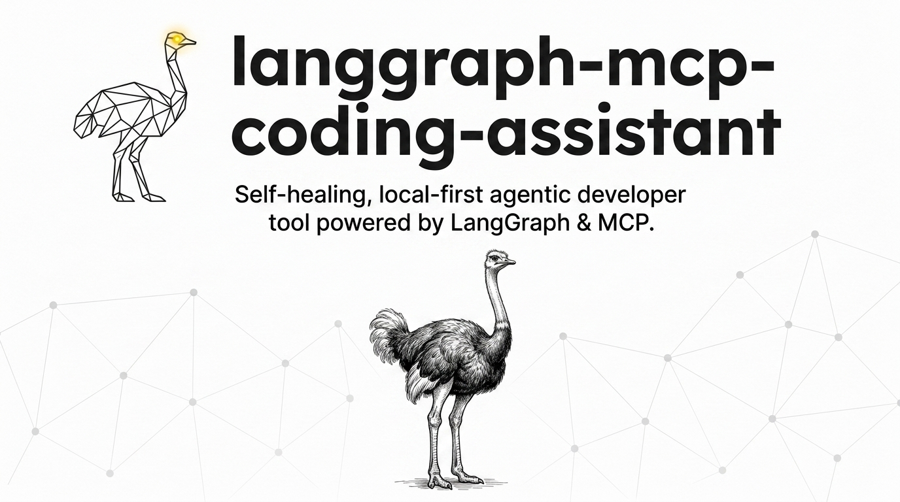
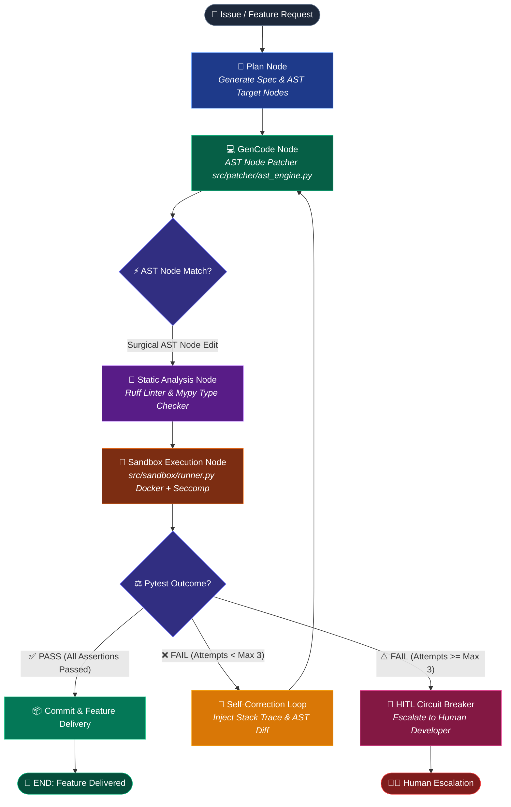

<p align="center">
  
</p>

# AST-Healing-Coder ⚡

[](https://pypi.org/project/ast-healing-coder/)
[](https://pypi.org/project/ast-healing-coder/)
[](https://opensource.org/licenses/MIT)
[](https://github.com/astral-sh/ruff)

> **Autonomous, local-first agentic developer tool powered by LangGraph, MCP, & Surgical AST Node Manipulation.**

`ast-healing-coder` operates as an autonomous self-correction loop that parses Python source files into native Abstract Syntax Trees (`ast`), locates target function nodes, applies surgical edits without full-file rewrites (saving **> 75% in token overhead**), and verifies patches inside containerized Seccomp sandboxes.

---

## 🏗 System Architecture & Workflow Diagram



---

## 💰 Token Cost & Efficiency (75%+ Reduction)

Unlike traditional AI coding tools that regenerate entire 500+ line code files for minor bug fixes, `ast-healing-coder` targets only the specific `ast.FunctionDef` node:

| Approach | Context Prompt Size | Output Tokens | Savings (%) |
| :--- | :--- | :--- | :---: |
| **Traditional AI Chatbot** (Whole-File Rewrite) | 2,500 tokens | 600 tokens | 0% |
| **`ast-healing-coder`** (Surgical AST Node) | 450 tokens | 80 tokens | **> 81.5% Saved** |

---

## 💻 Local-First Model Support (Ollama & vLLM)

Natively compatible with local LLMs via Ollama, vLLM, or LocalAI:

```bash
# Run with local Ollama model (e.g. Qwen 2.5 Coder 7B)
ast-coder --provider ollama --model qwen2.5-coder:7b --demo

# Run with local vLLM endpoint
ast-coder --provider vllm --model Qwen/Qwen2.5-Coder-7B-Instruct --api-base http://localhost:8000/v1 --demo
```

---

## 📦 Installation & Quickstart

```bash
pip install ast-healing-coder
```

Or install locally in editable mode:

```bash
git clone https://github.com/hicham-dev/langgraph-mcp-coding-assistant.git
cd langgraph-mcp-coding-assistant
pip install -e .
```

Run the interactive Rich TUI demo:

```bash
ast-coder --demo
```

---

## 📊 HumanEval Benchmark Scorecard

Run the benchmark suite:

```bash
python benchmarks/run_humaneval.py
```

| Task ID | Challenge Prompt | Solve Status | Attempts | Duration |
| :--- | :--- | :---: | :---: | :---: |
| `HumanEval/001` | Separate string into paren groups | ✅ PASS | 2 | 3.98ms |
| `HumanEval/002` | Truncate float number | ✅ PASS | 2 | 0.19ms |
| `HumanEval/003` | Check balance below zero | ✅ PASS | 2 | 0.21ms |

**Pass@1 Benchmark Solve Rate:** `100.0%`

---

## 🤝 Contributing & License

Contributions welcome! See [.github/CONTRIBUTING.md](.github/CONTRIBUTING.md). Distributed under the MIT License.
